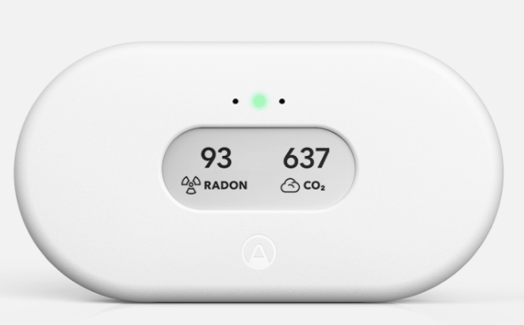
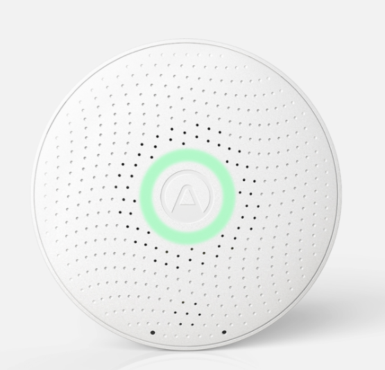

# iotlab-pilotcase-radicair

Radicair manufactures and sells Radon fans that regulate indoor radon levels by exchanging contaminated air with fresh outdoor air while maintaining neutral pressure and recovering heat energy.

Radon is a radioactive gas that enters buildings in Sweden through construction materials like pre-1975 aerated concrete (blue concrete), as well as from the ground and household water. Sweden has some of the highest indoor radon levels in the world, with many homes exceeding 200 Bq/m³. The Swedish Radiation Safety Authority estimates that radon in dwellings causes around [500 lung cancer cases per year](https://www.stralsakerhetsmyndigheten.se/en/areas/radon/) in Sweden, most commonly among smokers. Radon is the second-most common cause of lung cancer after smoking, and long-term exposure to high levels of this odorless, invisible gas poses a serious health hazard. Approximately 15% of lung cancers in Sweden are induced by indoor radon in dwelling buildings.

## Hardware

In this project, we have investigated possibilities of integration with various Radon sensors available on the market. 
Two sensors from Airthings: Airthings Wave Plus and Airthings View Plus and one from EcoSense (Ecoqube). 

### Airthings
The Airthings Wave Plus is a smart radon detector that provides real-time radon readings, temperature, humidity, CO2, and air pressure levels. The Airthings View Plus is a smart air quality monitor that provides real-time radon readings, temperature, humidity, CO2, and TVOC levels. Both devices are battery-powered and communicate over Bluetooth Low Energy (BLE).

  <table style="border-collapse: collapse" width="100%">
    <tr>
      <td
        valign="top"
        width="50%"
        style="border: 5px solid grey; padding: 10px"
      >
        

            
           
          

            Radon & air quality monitor with 7 sensors including radon, PM 2.5, CO2, and more   
            <a href="https://www.airthings.com/en/view-plus">View in store</a>
          

        

      </td>
      <td
        valign="top"
        width="50%"
        style="border: 5px solid grey; padding: 10px"
      >
        

           
          

            Bluetooth-enabled, smart monitor with 6 sensors measuring radon, CO2, VOCs and more.   
            <a href="https://www.airthings.com/en/wave-plus">View in store</a>
          

        

      </td>
    </tr>
  </table>

#### Airthings Wave Plus

[This directory](/airthings-wave/) contains the information needed and code to link an ESP32 microcontroller to an Airthings Wave Plus device through Bluetooth Low Energy (BLE). The Airthings Wave Plus tracks indoor air quality for Radon, CO2, VOCs, Humidity, Temperature, and Air Pressure. Using this code, you can wirelessly fetch Humidity, Temperature, and Short Term/Long Term Radon levels with the ESP32.

A small [python script](/main-wave.py) is also included to demonstrate how to fetch the sensor data from the Airthings Wave Plus device using a computer.

#### Airthings View Plus

[This directory](/airthings-view/) contains instructions for how to interact with the exposed REST API. The Airthings View Plus tracks indoor air quality for Radon, CO2, VOCs, Humidity, and Temperature. Using this code, you can wirelessly fetch Humidity, Temperature, and Radon levels with the ESP32.

A small [python script](/main-view.py) is also included to demonstrate how to fetch the sensor data from the Airthings View Plus device using the REST API.

## EcoQube from EcoSense 
 

 

            Intelligent Radon Monitor, With Remote Access To Trend Charts
            <a href="[https://ecosense.io/products/ecoqube](https://ecosense.io/products/ecoqube)">View in store</a>

         
Using a patented radon detection technology, the EcoQube delivers industry leading radon counting sensitivity of 30 counts per hour per pCi/L.
It uses Bluetooth for establishing the initial pairing, after that WiFi is used to send the measurements to the Ecosense server using an API. 
API is not open for consumer use, but there is a B2B offering. 
The Amazon auth service is used to authenticate all the requests and token is obtained using <a href="https://wiki.mozilla.org/Identity/AttachedServices/KeyServerProtocol#Login:_Obtaining_the_authToken">Key Server Protocol</a>, which makes it quite difficult to catch the traffic inbetween. 
The data then is displayed in a companion mobile app and can be imported as a csv file. 

 

### Accessing the Airthings API

The Airthings API is a RESTful service that lets users access data from Airthings devices, including information such as radon levels, temperature, and humidity. Users with Airthings devices can use the API through the Airthings mobile app or web portal.

For data retrieval, a Python script is available that works with the Radicair Hub. You can find this script [here](/src/airthings_data_getter.py).

This script is set up as a class that can run in a separate thread. It regularly sends GET requests to the Airthings API to gather data. The collected data is then sent to an MQTT broker using the `data_sender` class. The script uses credentials from a file to  authenticate API requests.

### User web interface

The web interface is doing two things. A user friendly way to enter the credentials for the airthings API and a way to set the mode and threshold for the radon.

The web server is a simple app made with flask. It has a form where the user can enter the credentials for the airthings API. The credentials are then stored locally in a file. The user can also set the mode and threshold for the radon. The mode is either temperature or radon. If the mode is temperature the fans will be adjusted according to the temperature. The threshold is for the radon mode. The credentials, mode and threshold are stored to a file and the the mode and threshold are sent to the mqtt server.

### The architecture of the system

Here is a high-level image overview of the architecture of the system:

The Airthings device sends data to the Airthings API, which users can access to obtain data from their own devices. The Radicair Hub retrieves this data from the API periodically. Based on the data, the hub adjusts the fan speeds according to the radon levels or temperature, depending on the mode selected by the user. The hub sends the fan speed values via MQTT. Additionally, the data is sent to the Radicair API, allowing users to view it through a web interface.
